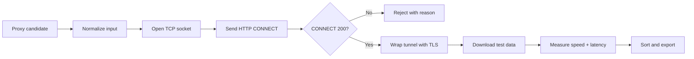

# Proxy Speed Tester

<p align="center">
  <strong>HTTP CONNECT proxy validator for Psiphon upstream-proxy workflows</strong>
</p>

<p align="center">
  
  
  
  
</p>

---

## Overview

**Proxy Speed Tester** is a lightweight Python utility for validating HTTP CONNECT proxies, measuring tunnel setup latency, running a real HTTPS download test through each proxy, and exporting working proxies sorted by speed or ping.

The project was developed for users who need to evaluate upstream-proxy candidates in restricted network environments, especially in countries such as Iran or other regions where Psiphon may not always connect directly and may require an upstream proxy to reach its tunnel infrastructure.

Instead of only checking whether a TCP port is open, this tool verifies whether a proxy can actually establish an HTTP CONNECT tunnel to an HTTPS endpoint and transfer data through that tunnel. That makes the output more practical for real upstream-proxy usage than a simple port scanner.

> Use this tool only with proxies you own, operate, or are explicitly authorized to test. Do not scan random IP ranges or abuse public infrastructure.

---

## Why This Exists

In heavily filtered or unstable networks, Psiphon may fail before it can bootstrap a direct tunnel. In that case, users sometimes configure an **upstream proxy** so Psiphon first connects through an external HTTP proxy and then negotiates its own tunnel from there.

A proxy that looks alive is not always useful for this purpose. For Psiphon-style upstream usage, a proxy should ideally:

- accept HTTP CONNECT requests,
- return a valid `HTTP/1.1 200` or equivalent success response,
- allow TLS traffic through the tunnel,
- transfer real HTTPS payloads,
- respond within a practical timeout,
- provide usable throughput instead of only opening a socket,
- remain stable long enough to complete the test.

This script focuses on that practical validation path.

---

## What It Tests

The tester performs a multi-stage check for each candidate proxy:



The result is a cleaner proxy list that is closer to real-world upstream-proxy behavior.

---

## Features

- Tests **HTTP CONNECT** proxy behavior.
- Measures tunnel setup latency, shown as ping-like milliseconds.
- Performs a real HTTPS download through the proxy.
- Sorts working proxies by speed or ping.
- Removes duplicate proxy entries.
- Accepts multiple common input formats.
- Generates Psiphon-ready `ip:port` output.
- Saves rejected proxies with failure reasons.
- Uses only Python standard library modules.
- Works well on lightweight environments such as desktop Python or Android/Pydroid-style setups.

---

## Important Scope

This tool is not a generic proxy scanner and not a SOCKS tester.

| Item | Status |
|---|---:|
| HTTP CONNECT proxy validation | Supported |
| HTTPS download through proxy | Supported |
| Latency measurement | Supported |
| Speed ranking | Supported |
| Psiphon-ready `ip:port` output | Supported |
| SOCKS4 native protocol test | Not supported |
| SOCKS5 native protocol test | Not supported |
| Random IP range scanning | Not included |
| Proxy anonymity grading | Not included |
| Malware or abuse testing | Not included |

If the input contains `socks4://`, `socks5://`, or `socks5h://`, the script strips the scheme and tests the endpoint as an HTTP CONNECT proxy. It does not perform a native SOCKS handshake.

---

## Supported Input Formats

Put your proxy list in one of these local files:

```text
proxy.txt
proxy
out.txt
```

Supported line formats:

```text
1.2.3.4:8080
1.2.3.4.8080
http://1.2.3.4:8080
1.2.3.4:8080 | ping=100ms | speed=200KB/s
```

The parser also ignores empty lines and comment lines that start with `#`.

---

## Output Files

The script creates these files locally:

| File | Description |
|---|---|
| `fast_out.txt` | Working proxies only, sorted and ready to copy/use |
| `speed_details.txt` | Detailed speed, ping, elapsed time, and transferred bytes |
| `bad.txt` | Rejected proxies with failure reasons |

Generated files are intentionally excluded from Git and should not be committed.

---

## Usage

Clone the repository:

```bash
git clone https://github.com/TheLouisMahdi/proxy-speed-tester.git
cd proxy-speed-tester
```

Create your local proxy list:

```bash
copy proxy.example.txt proxy.txt
```

On Linux/macOS:

```bash
cp proxy.example.txt proxy.txt
```

Edit `proxy.txt` and add your authorized proxies.

Run the tester:

```bash
python proxy_speed_tester.py
```

On some systems:

```bash
python3 proxy_speed_tester.py
```

---

## Configuration

You can tune the behavior at the top of `proxy_speed_tester.py`:

```python
MAX_WORKERS = 8
TIMEOUT = 8
SPEED_TEST_BYTES = 512 * 1024
SPEED_ATTEMPTS = 1
SORT_BY = "speed"
```

### Main Settings

| Setting | Meaning |
|---|---|
| `MAX_WORKERS` | Number of proxies tested in parallel |
| `TIMEOUT` | Socket and download timeout in seconds |
| `SPEED_TEST_BYTES` | Amount of data requested per speed test |
| `SPEED_ATTEMPTS` | Number of attempts per proxy |
| `SORT_BY` | Output ranking mode: `speed` or `ping` |

Sorting modes:

```python
SORT_BY = "speed"  # highest speed first
SORT_BY = "ping"   # lowest tunnel latency first
```

For mobile networks or restricted networks, keep `MAX_WORKERS` conservative. Too many parallel checks can make results noisy, trigger rate limits, or overload the local connection.

---

## Test Target

The default HTTPS speed-test target is:

```text
speed.cloudflare.com
```

The script sends an HTTP CONNECT request to the proxy for:

```text
speed.cloudflare.com:443
```

If the proxy returns a successful CONNECT response, the script creates a TLS session through that tunnel and downloads a fixed-size test payload.

---

## How to Read Results

Example output:

```text
[FAST OK] 1.2.3.4:8080 | 430.21KB/s | 3.52Mbps | ping=180.4ms
[BAD/SLOW] 5.6.7.8:3128 | timeout
```

### Result Meaning

| Result | Meaning |
|---|---|
| `FAST OK` | Proxy passed CONNECT, TLS, and download test |
| `timeout` | Proxy did not respond within the configured timeout |
| `connection refused` | Host actively rejected the TCP connection |
| `http status 403/407/502/...` | Proxy responded but did not allow the CONNECT tunnel |
| `not http response` | Endpoint did not behave like an HTTP proxy |
| `ssl error` | CONNECT succeeded but TLS failed through the tunnel |
| `download timeout` | TLS or download path was too slow or unstable |

---

## Psiphon Upstream Proxy Workflow

The main output file is:

```text
fast_out.txt
```

It contains clean `ip:port` entries, one per line, which are easier to copy into Psiphon-style upstream proxy fields or other tools that expect plain proxy endpoints.

Recommended workflow:

1. Add candidate HTTP proxies to `proxy.txt`.
2. Run the tester.
3. Open `fast_out.txt`.
4. Start with the top entries.
5. If speed is the priority, keep `SORT_BY = "speed"`.
6. If connection setup latency is the priority, use `SORT_BY = "ping"`.

A passing result does not guarantee that Psiphon will always connect, because routing, filtering rules, proxy stability, ISP behavior, and Psiphon's own connection strategy can change. However, passing proxies are stronger candidates because they already proved HTTP CONNECT and HTTPS data transfer.

---

## Iran and Restricted-Network Use Case

This project is especially useful in environments where direct Psiphon connection attempts may fail or become unstable because of filtering, routing interference, packet loss, or blocked bootstrap paths.

In these cases, a working upstream proxy can sometimes act as the first reachable hop. The goal of this tool is not to modify Psiphon itself, but to quickly filter a large local list of proxy candidates down to the few entries that are more likely to work as upstream proxies.

The tester is designed for practical selection:

- remove dead endpoints,
- reject non-HTTP proxy ports,
- detect proxies that do not support CONNECT,
- identify extremely slow or unstable candidates,
- rank usable proxies by measured throughput or tunnel latency,
- export a clean Psiphon-ready list.

---

## Example Terminal Output

```text
Input file: proxy.txt
Number of proxies to speed test: 120
Speed test size per proxy: 512KB
Sort by: speed
----------------------------------------------------------------------
[FAST OK] 1.2.3.4:8080 | 430.21KB/s | 3.52Mbps | ping=180.4ms
[BAD/SLOW] 5.6.7.8:3128 | timeout
Progress: 25/120 | Good: 4
----------------------------------------------------------------------
Finished.
Total tested: 120
Working tested proxies: 12
Psiphon-ready output: fast_out.txt
Speed details: speed_details.txt
Rejected proxies: bad.txt
```

---

## Privacy and Data Handling

This script runs locally. It does not upload your proxy list anywhere.

However, the proxies you test will receive CONNECT attempts from your device or network. The HTTPS speed-test server will also see traffic coming through the tested proxy.

Keep real proxy lists private:

```text
proxy.txt
fast_out.txt
speed_details.txt
bad.txt
```

Do not commit these files to public repositories.

---

## Safety and Responsible Use

- Use only proxies you own or are authorized to test.
- Do not scan random IP ranges.
- Do not use the tool to abuse open relays or third-party infrastructure.
- Do not publish working private proxy lists.
- Respect local laws, network policies, and service terms.
- Treat the output as connectivity diagnostics, not as a guarantee of privacy or anonymity.

---

## Troubleshooting

### Most proxies fail with `timeout`

Reduce parallelism and increase timeout:

```python
MAX_WORKERS = 4
TIMEOUT = 12
```

### Many proxies show `not http response`

Those endpoints are probably not HTTP CONNECT proxies. They may be SOCKS, raw TCP services, blocked ports, or unrelated services.

### Speed looks too low

Increase the test size for a more stable measurement:

```python
SPEED_TEST_BYTES = 1024 * 1024
```

This uses more data but can produce more realistic speed ranking.

### Psiphon still does not connect

A proxy passing this test only proves that it supports HTTPS tunneling to the configured test target. Psiphon may still fail due to upstream restrictions, proxy instability, DNS behavior, blocked Psiphon endpoints, ISP routing, or app-side connection strategy.

---

## Repository Layout

```text
.
├── proxy_speed_tester.py      # Main tester script
├── proxy.example.txt          # Safe example input file
├── README.md                  # Project documentation
└── LICENSE                    # License
```

---

## License

This project is released under the MIT License.
